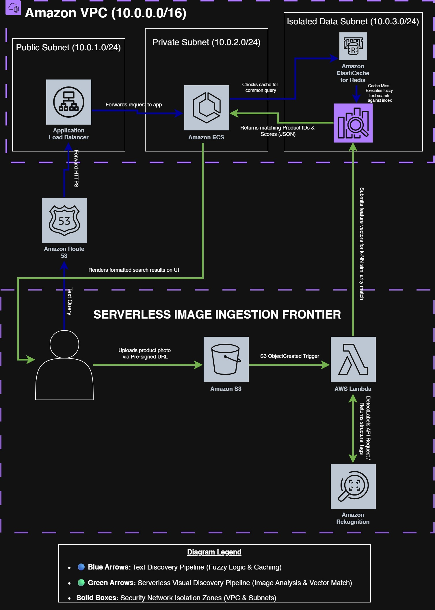

Serverless Multimodal Search & Discovery Subsystem

An enterprise-grade, fully decoupled architectural blueprint implementing semantic full-text retrieval and an event-driven serverless visual (image-based) discovery pipeline. Designed for high-concurrency e-commerce marketplaces, this subsystem shifts resource-intensive search tasks completely away from primary transactional databases (OLTP) onto dedicated cloud-native discovery tiers.


System Architecture

Below is the infrastructure topology mapping the secure, multi-tier network boundaries and the dual-pathway processing workflows.

 


Key Subsystems & AWS Service Mapping

1. Lexical & Semantic Text Search Pathway
*Amazon OpenSearch Service**: Replaces rigid relational query matching with a distributed search index supporting fuzzy string evaluation (Levenshtein Distance), field tokenization, and custom synonym mapping dictionaries designed to handle regional shopping dialects.
*Amazon ElastiCache for Redis**: Acts as an inline memory tier to store and immediately serve frequent, repetitive search string queries, cutting cluster computing overhead and preserving sub-millisecond front-end latency during high traffic peaks.

2. Automated Multimodal Visual Pathway
*Amazon S3 Ingestion Bucket**: Provides high-throughput, private storage for temporary end-user media file uploads (screenshots/photographs) via highly restricted, short-lived Pre-Signed URLs.
*AWS Lambda**: Executes decoupled, on-demand orchestration compute tasks that process image payloads asynchronously upon arrival.
*Amazon Rekognition**: Invoked by Lambda to extract structural metadata attributes, object boundary coordinates, and categorical labels from the uploaded media binary.
*OpenSearch k-Nearest Neighbor (k-NN) Engine**: Resolves matching inventory items by performing vector space similarity measurements (Cosine Distance) between the image extraction vector embeddings and the vectorized product catalog.


Detailed Data Flows

Pathway A: Semantic Text Search Lifecycle
1. The user client pushes a query string payload to the API layer via **Amazon Route 53** and an internet-facing **Application Load Balancer (ALB)**.
2. The request is consumed by the **Amazon ECS** application tier residing in the Private Subnet.
3. ECS queries the **Amazon ElastiCache (Redis)** cluster inside the Isolated Data Subnet.
4. **Cache Hit**: Formatted search result objects are instantly returned back to the user interface.
5. **Cache Miss**: The ECS tier dispatches a secure request to the **Amazon OpenSearch Service** cluster. OpenSearch executes fuzzy text scoring and synonym expansion, returning product records back to ECS for UI translation.

Pathway B: Event-Driven Visual Search Lifecycle
1. The user client triggers a visual search action and requests an ingestion point. 
2. **Amazon API Gateway** maps the request to a brief Lambda handshake that returns an **S3 Pre-Signed URL** (valid for 120 seconds).
3. The mobile client uploads the binary photo file directly to the **Amazon S3 Ingestion Bucket**, offloading the data payload entirely from core web application instances.
4. The file landing fires an `s3:ObjectCreated:*` trigger, automatically invoking the orchestration **AWS Lambda function**.
5. Lambda extracts the object key, passes it to **Amazon Rekognition** (`DetectLabels`), and captures high-confidence structural metadata strings.
6. Lambda translates these metadata traits into vector attributes and issues a **k-Nearest Neighbor (k-NN)** similarity evaluation request against the OpenSearch database index.
7. OpenSearch evaluates the nearest index points and returns matching catalog rows back to the **Amazon ECS application tier**, which safely handles delivery back to the consumer app.


Security Architecture & Boundary Isolation

This design follows a strict **Zero-Trust Networking** paradigm and enforces the **Principle of Least Privilege**:
*Network Compartmentalization**: All data storage configurations, indexing engines, and caching clusters are locked down within a dedicated *Isolated Data Subnet* lacking internet pathways. Communication boundaries are constrained strictly to internal ingress traffic coming from the ECS security group on authorized ports.
*Granular IAM Boundary Restrictions**: Execution policies are highly restricted. The serverless processing Lambda function explicitly lacks wildcard elements, keeping its actions bounded only to localized object reading, Rekognition translation, and OpenSearch API posts.
*Data Protection**: Perimeter infrastructure is shielded against malicious string injection payloads and automated catalog scraping using **AWS WAF**. Data objects remain protected using full **AWS KMS** volume encryption at rest and mandatory **TLS 1.3** across all interior routing networks.

Deployment & Operational Configurations
Index Schema Mapping Example
Below is the deployment blueprint utilized for establishing the OpenSearch multi-vector spatial index:

```json
{
  "settings": {
    "index": {
      "knn": true
    }
  },
  "mappings": {
    "properties": {
      "product_id": { "type": "keyword" },
      "product_name": { "type": "text" },
      "visual_vector": {
        "type": "knn_vector",
        "dimension": 1024,
        "method": {
          "name": "hnsw",
          "space_type": "cosinesimil",
          "engine": "nmslib"
        }
      }
    }
  }
}
